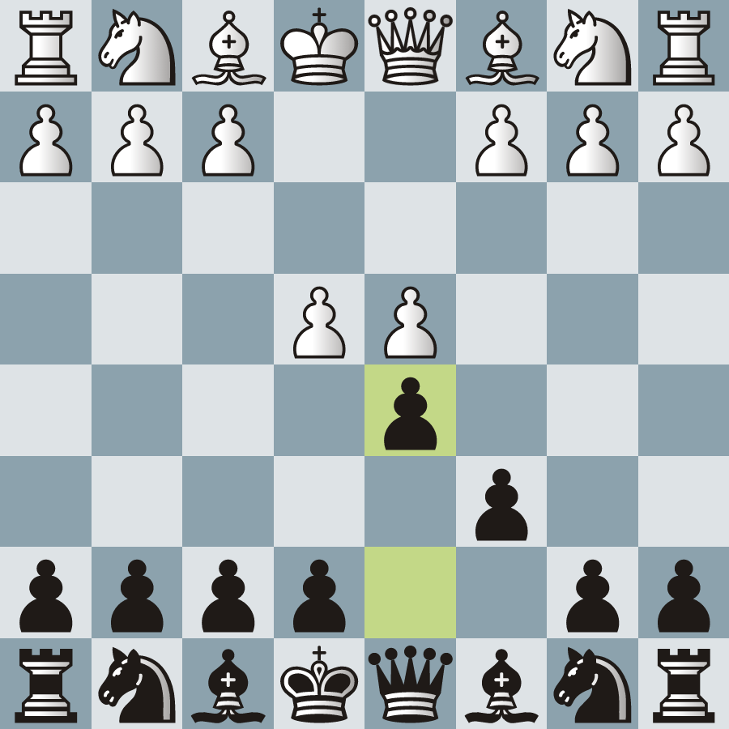

# Obsidian Chess

> An Obsidian plugin for all your Chess related notes.

## Index

- [Usage](#usage)
- [Documentation](#documentation)
- [Features](#features)
- [Roadmap](#roadmap)
- [Q&A](#qa)
- [Inspiration](#inspiration)
- [Technology](#technology)
- [Support me](#support-me)

## Usage

Simply create a code-block with the language set as `chess` and then pass the arguments in a [YAML syntax](https://docs.ansible.com/ansible/latest/reference_appendices/YAMLSyntax.html).

Here is a simple board displaying a variation of the Caro-Kann opening:

````yaml
```chess
fen: rnbqkbnr/pp2pppp/2p5/3p4/3PP3/8/PPP2PPP/RNBQKBNR
flipBoard: true
lastMove: d7d5
```
````



> **Note:** You can easily get the FEN code of the position from the website where you play online chess. For example: [Lichess' board editor](https://lichess.org/editor?fen=rnbqkbnr%2Fpp2pppp%2F2p5%2F3p4%2F3PP3%2F8%2FPPP2PPP%2FRNBQKBNR+w+KQkq+-+0+2).

## Documentation

Here is a list of all the arguments that can be passed to the code-block:

| Parameters | Type    | Description                                           | Default           |
| ---------- | ------- | ----------------------------------------------------- | ----------------- |
| fen        | string  | The FEN code of the position                          | "8/8/8/8/8/8/8/8" |
| flipBoard  | boolean | If the board should be flipped to black's perspective | false             |
| lastMove   | string  | The two squares to be highlighted as a last move      | null              |
| check      | string  | The square to be highlighted as a check               | null              |

## Features

Here is a condensed list of the plugin's features:

- Display a chess position by passing its **FEN code**.
- Customize the board with different **themes and piece sets**.
- If you don't like the built-in themes, **create your own**.
- **Flip the board** to see it from black's perspective.
- Highlight the tiles of the **last move** or **check**.
- See the board tile's **coordinates**.

## Roadmap

Here is a condensed list of future features:

- Ability to display **arrows** between tiles to show the main ideas of the position.
- Ability to **mark tiles** to show their importance in the position.
- **Board editor** window to automatically generate the code-blocks for you.

## Q&A

**Q:** Why did you make this plugin?

- **A:** When I tried to make some notes about a new chess opening I was learning, I didn't find a way to embed a chess position on an markdown file since Lichess' `<iframe>` only allows to display full games. So i resorted to just taking a screenshot of Lichess' board editor and pasting that image in the markdown file. When I head of the [Obsidian October](https://publish.obsidian.md/hub/11+-+Events/Obsidian+October+2021) contest I thought it would be a good excuse to make a chess plugin.

**Q:** What's your rating?

- **A:** I'm quite bad at chess; I'm still just learning and have only recently started taking the game seriously. As of writing this I'm around 1400 to 1500 on rapid (only time control I play is 10+0). If you're interested, you can check out my [lichess account](https://lichess.org/@/frizd). I have never played on a tournament, so I don't have an official FIDE rating.

## Inspiration

As you might have already noticed, this plugin was heavily inspired by [Lichess](https://lichess.org/).

- The themes were reverse engineered, with a color-picker, from their their website.
- The piece sets were grabbed from [Lichess' official assets](https://github.com/ornicar/lila/tree/master/public/piece).

## Technology

For all the interested nerds out there, this plugin was built with [Svelte](https://svelte.dev/). Feel free to use this plugin as a template for you future Svelte plugin.

## Support me

If you found this plugin useful, consider buying me a coffee ☕ (or a beer 🍺) and leaving a thank you message.

<a href="https://www.buymeacoffee.com/pmorim" target="_blank"></a>
